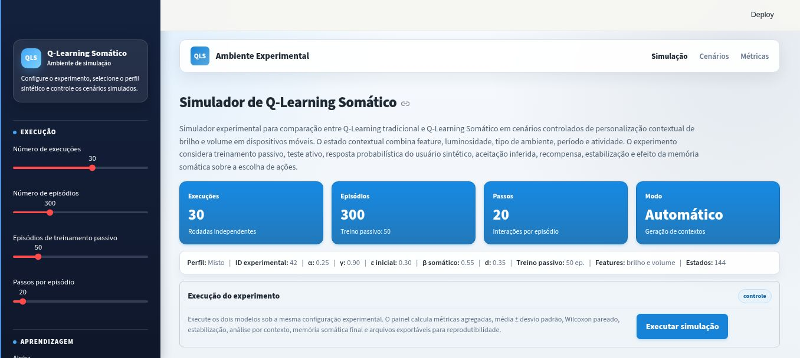
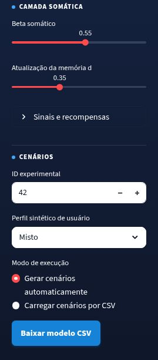
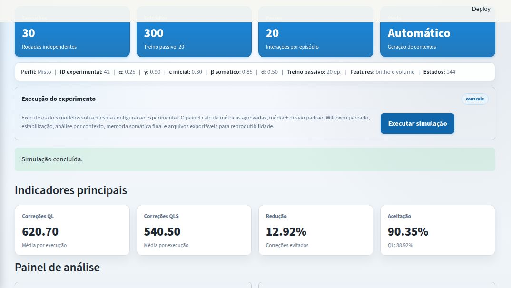
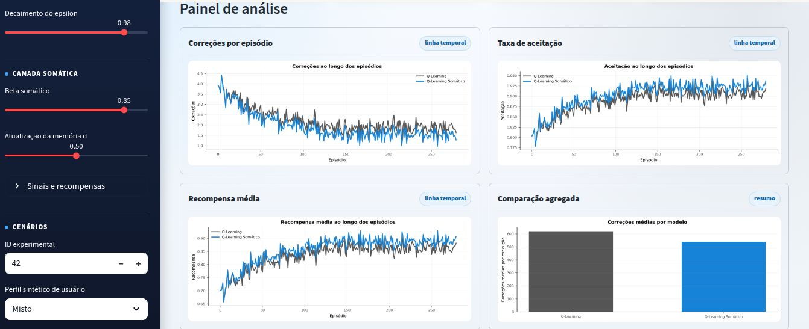
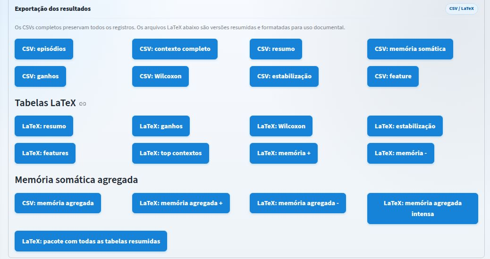

# Simulador de Personalização Contextual

Este repositório contém um simulador Python/Streamlit para comparar Q-Learning tradicional e Q-Learning Somático em tarefas de personalização contextual de brilho e volume em dispositivos móveis.

## Execução

Para instalar as dependências e executar o simulador:

pip install -r requirements.txt

streamlit run app.py

## Descrição

O simulador avalia agentes em cenários com usuários sintéticos probabilísticos, estados contextuais discretos, ações de configuração, aceitação inferida, correções, reversões, recompensa média e análise estatística pareada.

## Interface

A interface permite configurar a simulação, executar os agentes e exportar os resultados.

### Visão geral

### Configuração de cenários

O simulador permite gerar cenários automaticamente ou carregar uma sequência externa por CSV. Um arquivo de exemplo é disponibilizado em `exemplo_cenarios.csv`.

### Indicadores após execução

Após a simulação, são exibidos indicadores agregados de correções, redução relativa e aceitação inferida.

### Painel de análise

O painel apresenta curvas por episódio e comparação agregada entre Q-Learning e Q-Learning Somático.

### Exportação

Os resultados podem ser exportados em CSV e LaTeX, incluindo episódios, contextos, estatística pareada, memória somática e tabelas resumidas.

